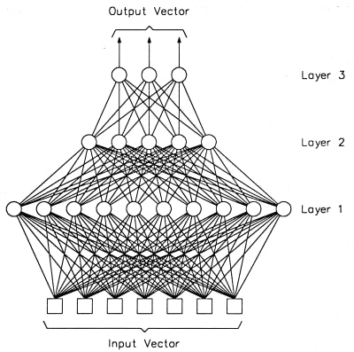

## Multi-Layer Perceptron

다층 퍼셉트론(multi-layer perceptron, MLP)는 퍼셉트론으로 이루어진 층(layer) 여러 개를 순차적으로 붙여놓은 형태입니다. MLP는 정방향 인공신경망(feed-forward deep neural network, FFDNN)이라고 부르기도 합니다. 입력에 가까운 층을 아래에 있다고 하고, 출력에 가까운 층을 위에 있다고 이야기합니다. 신호는 아래에서 위로 계속 움직입니다. MLP에서는 인접한 층의 퍼셉트론간의 연결은 있어도 같은 층의 퍼셉트론끼리의 연결은 없습니다. 또, 한번 지나간 층으로 다시 연결되는 피드백(feedback)도 없습니다. 제일 아래 입력 층과 제일 위 출력 층을 제외한 다른 층들은 숨겨져 있다고 해서 은닉층(hidden layer)이라고 합니다. 아래 그림의 경우 총 3개 층이 있습니다.



각 층은 그래프 구조에서 하나의 노드처럼 동작합니다. 즉, 입력이 들어오면 연산을 한 후 출력을 내보냅니다. 대부분의 라이브러리들이 층을 구현의 최소 단위로 삼는 이유이기도 합니다. MLP는 층의 갯수(depth)와 각 층의 크기(width)로 결정됩니다.

\\(i\\)번째 층이 \\(N\\)차원 벡터를 받아 \\(M\\)차원 벡터로 바꿔 표현한다고 할 때, 어떤 방식으로 계산되는지를 보겠습니다. 우선 \\(i\\)번째 층에 들어가는 입력은 \\(N\\)차원 벡터입니다. \\(M\\)차원 벡터의 각 차원은 입력 \\(N\\)개 전부에 영향을 받고, 각 차원 자체의 중요도를 보정받습니다. 마지막으로 계산된 값을 활성화 함수에 넣어 비선형이 되도록 합니다.
$$
y_k = f_i(\sum_{j=1}^N x_j w_{jk} + b_k)
$$

위 식을 \\(k=1,2,...M\\)까지 확대하면 다음과 같이 행렬-벡터 곱으로 나타낼 수 있습니다.
$$
y = f_i(xW + b)\\
x \in \mathbb{R}^N, W \in \mathbb{R}^{N \times M}, b \in \mathbb{R}^M, y \in \mathbb{R}^M
$$

만약 한 번에 \\(B\\)개의 데이터를 동시에 계산하고 싶다면, 행렬-행렬 곱으로 나타낼 수 있습니다.
$$
Y = f_i(XW + b)\\
x \in \mathbb{R}^{B \times N}, W \in \mathbb{R}^{N \times M}, b \in \mathbb{R}^M, y \in \mathbb{R}^{B \times M}
$$

위의 경우, 편향치 \\(b\\)를 더할 때 차원 문제가 생깁니다. 가중치 \\(W\\)를 곱한 후에는 2차원 행렬인데, \\(b\\)는 1차원 벡터이기 때문입니다. 식에는 문제가 있지만, 저대로 구현해도 TF 상에서는 문제가 발생하지 않습니다. 차원이 차이나는 두 텐서를 연산할 때 몇몇 조건이 맞으면 차원이 더 큰 값으로 브로드캐스팅(broadcasting)이 이루어지기 때문입니다. 위의 경우, 저 연산에 한해 \\(b\\)는 \\( \mathbb{R}^{B \times M}\\) 처럼 동작합니다. 같은 행이 \\(B\\)번 반복된 행렬입니다.

위와 같은 식으로 만든 한 층을 전부 연결된 층(**fully-connected layer**, FC) 혹은 조밀층(**dense layer**)이라고 합니다.

> 한글 용어는 아직 정착되어 있지 않습니다. 더 나은 표현이 생각나면 말해주세요!

**Example Model**

MLP의 예제로, 784 - 1000 - 1000 - 10 을 생각해 보겠습니다. 이 때 은닉층은 2개, 깊이는 3층, 각 은닉층의 크기는 1000 입니다. 활성 함수로는 ReLU를 사용하고 마지막 활성 함수로는 softmax를 사용합니다.
```python
h1 = tf.nn.relu(tf.matmul(x, W1) + b1)
h2 = tf.nn.relu(tf.matmul(h1, W2) + b2)
y = tf.nn.softmax(tf.matmul(h2, W3) + b3)
```

이 경우 가중치와 편향치의 갯수를 세 보도록 하겠습니다.

* W: 784x1000 + 1000x1000 + 1000x10 = 1794000 개
* b: 1000 + 1000 + 10 = 2010 개

총 1,796,010 개(약 1.8M)의 변수를 사용하는 MLP입니다.


---

## Universal Approximator

머신 러닝에 바라는 것은 \\(x\\)를 통해 우리가 원하는 \\(y\\)를 만드는 것입니다. 예를 들어, 숫자 이미지가 들어오면 숫자가 얼마인지 출력하게 하고 싶은 것입니다. 사람이 그걸 학습하고 있으니까, 최적의 함수인 \\(y=f^*(x)\\)는 분명 존재합니다. 다만 저 함수를 정확히 맞추는 것이 과연 가능한지가 의문이 듭니다. 머신 러닝은 최적의 함수를 근사(approximation)하는 함수를, 데이터를 기반으로 학습합니다.

여기서는 지도 학습(supervised learning)의 형태를 생각하고 이야기합니다. 우리가 딥러닝에 주는 것은 입력의 형태와 원하는 출력의 형태밖에 없습니다. 은닉층에서 어떻게 계산하고 어떤 특징(feature)들을 추출해 내야 할 지에 대해서는 우리도 정보를 주지 못합니다. 다행스럽게도 MLP는 universal approximation theorem 에 의해 적어도 하나의 충분히 큰 은닉층이 있으면 어떤 함수도 모방할 수 있습니다.

즉, MLP 구조를 잘 잡고 변수를 잘 설정한다면 분명 우리가 원하는 최적 함수를 만들 수 있습니다. 하지만 그게 '훈련 가능하다'로 이어지는 것은 아닙니다. 그리고 얼마나 한 층이 커야 '표현 가능한지'에 대해서도 알려주지 않습니다. 몇 가지 증명된 것은, 깊게 만들면 깊게 만들 수록 더 작은 크기로도 동일한 함수를 모방할 수 있다는 것입니다. [1]

> [1] On the Number of Linear Regions of Deep Neural Networks
> (Guido Montufar, Razvan Pascanu, Kyunghyun Cho, Yoshua Bengio, 2014)
---