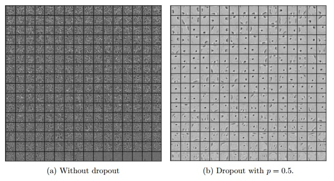

## Dropout

Dropout [1]은 간단하지만 아주 강력한 정규화(regularization) 방법입니다. 최근 나온 기법들에 밀리지 않고 여전히 유용하고 좋은 성능을 보여줍니다.

> [1] Dropout: A Simple Way to Prevent Neural Networks from Overfitting
> (Nitish Srivastava, Geoffrey Hinton, Alex krizhevsky, Ilya Sutskever, Ruslan Salakhutdinov, 2014)

훈련을 통해 학습되는 머신러닝 및 딥러닝의 특성상, 무작위로 초기화되고 무작위로 데이터에 접근한다는 방식 때문에 같은 데이터로 훈련한 모델이더라도 다른 결과를 낼 수 있습니다. 하지만, 같은 데이터로 여러 개의 서로 다른 모델을 훈련한 뒤 그 결과를 다수결 등으로 종합해 보면 통계적으로 덜 '튀는' 결과가 나와 더 높은 정답률을 얻게 됩니다. 이 방식을 앙상블(**ensemble**) 모델이라고 합니다. 앙상블은 가장 대표적인 정규화 방법이기도 합니다. Dropout은, 비록 모델은 여러 개를 만들지 못하지만 훈련 과정에서 앙상블의 효과를 내게 됩니다. 같은 변수들을 공유하는 하나의 모델만을 사용한다는 점이 일반적인 앙상블 모델과 다른 점입니다.

하나의 인공신경망에서 앙상블을 실현시키기 위해서, 훈련 단계에서 dropout 은 강제로 특정 퍼셉트론을 없애버립니다. 그 과정에서 그 퍼셉트론에 연결된 가중치들도 의미없는 값이 됩니다. 구현할 때는 일단 계산한 후 0 or 1 마스크를 곱해 결과값을 0으로 만들어버리는 방식으로 구현합니다. 매번 미니 배치가 들어올 때마다 무작위로 다른 퍼셉트론들을 끊어냅니다. 이 과정에서 약간씩 다른, 엄청 다양한 구조가 학습된다고 생각할 수 있습니다. 한번 끊은 퍼셉트론이 다시 연결이 안 되는 경우에는 퍼셉트론이 가지치기(**pruning**)되었다고 이야기합니다.

위 그림에선 입력과의 연결이 없는(!) 경우가 생기지만, 실제로는 한 층의 차원이 엄청 큰 데다가 정해진 비율만큼을 마스킹하기 때문에 완전히 연결이 안 되는 층이 발생하지 않습니다. 매 훈련마다 원래 구조보다 조금 더 '얇은' 구조를 만나게 됩니다. 지수적으로 많은 경우의 수가 발생할 수 있기 때문에 늘 조금씩 다른 구조를 훈련하게 될 것입니다. Dropout에는 연결을 계속 끊어 비슷한 위치에 있는 퍼셉트론은 비슷한 특징에 집중해 버리는 상호 동조(co-adaptation)를 예방하는 의미도 있습니다.

의도하는 정규화 방식이 다르기 때문에 norm 패널티와 섞어 써도 잘 됩니다! 하지만 데이터가 적은 상황에서는 오히려 dropout 이 안 좋을 때도 있습니다. 마스킹될 확률을 너무 높이거나, 애초에 구조 자체가 작은 경우에도 dropout 을 적용하는 것이 오히려 성능을 악화시킬 수 있습니다.

**Training and Inference**

훈련할 때는 일반적인 SGD 알고리즘을 사용할 수 있습니다. 단, 훈련을 위해 역전파(backprop)을 할 때 마스크가 씌워져 있던 값을 지날 때는 다시 마스크를 씌운 미분값을 전파해야 합니다. 다른 말로 하면, 훈련 때 사용하지 않은 퍼셉트론과 연결된 가중치들은 업데이트되지 않습니다.

훈련을 마치고 추론(inference)에 사용할 때는 모든 연결을 사용한다는 점에 주의해야 합니다! 하지만 그냥 이대로는 문제가 있습니다. 훈련 때 사용했던 퍼셉트론 수와 테스트 때 사용할 퍼셉트론 수가 다르기 때문에, 훈련한 대로의 결과를 얻지 못할 수 있습니다. 이전 층이 1000차원이었고 dropout 비율이 0.3이었다면 훈련때 마다 다음 층의 입력들은 약 700개의 입력을 받으며 훈련되었을 것입니다. 그런데 갑자기 1000차원 입력이 들어오면 값의 크기에서도 문제가 생깁니다. 그래서 원칙적으로는 크기 조정(rescale)을 해 줘야 합니다. 배치 표준화(batch normalization)이 나온 요즘은 활성값(activation)들의 크기가 저절로 조절되니 굳이 안 해도 괜찮은 듯 합니다.

보통 입력은 20% 정도(입력 데이터도 마스킹할 수있습니다!), 은닉층(hidden layer)은 50% 정도까지 생략하고 연결해도 괜찮습니다. 크기 조정에는 두 가지 접근법이 있습니다. 첫 번째는 그냥 훈련하고 추론 때는 각 가중치를 0.7배 해 주는 것입니다. 두 번째는, 훈련 때부터 가중치를 계속 0.7로 나눠 주는 것입니다. 첫 번째 방식은 각 퍼셉트론이 70% 확률로 존재하는 것을 보정한다는 개념이고, 두 번째 방식은 없는 30% 퍼셉트론을 다른 퍼셉트론을 강화해 보상하겠다는 개념이 됩니다. 둘 다 구현이 크게 어렵지 않습니다.

**Fast Dropout**

Drpout이 느린 것은 매번 무작위로 선택하기 때문입니다. 그런데, 그러지 말자는 게 fast dropout 기법의 핵심입니다. 베르누이 분포(Bernoulli distribution)에서 고정 확률로 엄청 많이 추출하면 가우시안 분포(Gaussian distribution)이 됩니다. 그러니 그냥 바로 Dropout 마스크로 가우시안 마스크를 쓰자는 것입니다. 즉, 0/1 이진 마스크 대신 가우시안에서 추출한 마스크를 만들어 곱합니다. 이 때 \\(N(0, p(1-p))\\) 를 사용합니다. 일반적인 dropout 보다 10배 정도 빠르다고 하고, 성능은 비슷하거나 더 좋은것 같습니다.

**Ad-hoc dropout**

위와 비슷하지만, 가우시안 분포 대신 0에서 1 사이에서 균일 분포(uniform distribution)로 추출한 마스크를 사용하는 것입니다. 딱히 이론적 배경은 없지만, 실전에서는 동작합니다.

---

## DropConnect

DropConnect [2]는 Dropout의 일반화된 버전입니다. Dropout이 퍼셉트론을 끊어 앞뒤로 연결된 가중치도 같이 없어지게 하는 것이라면, Dropconnect 는 가중치들만 끊어 없앱니다. 아직도 벤치마크 상위에 랭크된 기법입니다.

> [2] Regularization of Neural Networks using DropConnect
> (Li Wan , Matthew Zeiler, Sixin Zhang, Yann LeCun, Rob Fergus)

Dropout 은 활성값들에 마스크를 씌우는 것이기 때문에 별도의 층으로 만들 수 있지만, Dropconnect 는 활성값이 아니라 가중치에 마스크를 씌우기 때문에 별도로 내부를 구현해야 합니다.

---