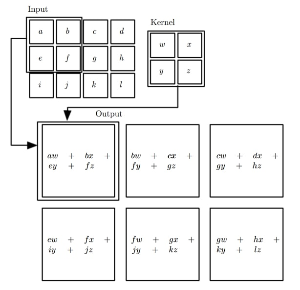

## What is CNN?

합성곱 인공신경망(convolutional neural network, CNN)은 인공신경망의 여러 층 중 convolution 연산을 사용하는 층이 있는 NN을 의미합니다. 보통 convolution 연산을 수행하는 convolution 층이 아래쪽에 있고 위쪽에 MLP가 붙어 있는 형태입니다. Convolution 이 갖고 있는 여러 장점들 덕분에 엣날부터 convolution 은 신호 처리와 이미지 처리 분야에서 많이 사용되었고, 실제로도 좋은 성능을 냅니다. 그럼에도 불구하고 딥러닝에 와서야 인기를 얻는 이유는, convolution 을 하는 것은 어마어마한 연산량이 필요하다는 단점이 GPU 시대가 와서 극복되었기 때문입니다. 최근에는 1D, 2D 뿐만이 아니라 시간축을 포함해 동작하는 3D convolution 기반 특징 추출 논문들도 나오고 있습니다.

CNN은 보통 convolution 층과 pooling 층을 갖고 있습니다. 이 과정은 입력 이미지에서 다양한 특징들을 추출해냅니다. Convolution 층과 pooling 층은 그 자체로는 분류 등 문제를 해결할 수 있는 구조는 아니기 때문에, 보통 이렇게 추출한 특징을 넣을 수 있는 MLP를 뒤에 붙여 목표 달성을 노립니다. CNN을 convolution 이 들어가는 전반부 특징 추출 파트와 그 특징을 사용하는 뒤쪽 파트로 나눠 생각할 수 있습니다.

실제로도 이런 개념적인 분리가 의미있는 것이, 특징을 추출하는 데 사용한 앞쪽 부분은 다른 이미지를 넣어도 특징을 잘 분류해 냅니다. 즉, ImageNet같이 방대하고 다양한 이미지가 있는 데이터로 훈련된 특징 추출 파트는 완전히 다른 이미지를 넣어도 어느 정도 훌륭한 특징들을 뽑아냅니다. CNN의 핵심은, 여러가지 특징을 여러 곳에서 뽑아내는 것입니다! 더 좋은 특징을 추출해 낼 수록 뒤에서 그 특징으로 목표를 달성하기 쉬워집니다. 바로 뒤에서 convolution 이 왜 잘 동작하는지에 대해 다룹니다.

**Convolution and Correlation**

Convolution 은 신호처리 분야에서 가장 많이 사용되는 연산 중 하나입니다. 1D, 2D, 3D 등 다양한 형태의 convolution 이 있습니다. 한글로 convolution 은 합성곱(혹은 얽힘곱)이라고 하는 것 같습니다. Convolution 은 기본적으로 입력 신호에 특정 형태의 필터를 씌워 원하는 결과를 얻는 방법입니다. 그 필터는 다른 신호가 될 수도 있고 고정된 값이 될 수도 있습니다. 딥러닝에서 다루는 convolution 은 보통 고정된 값의 필터를 사용하고 있습니다. 그리고 그 필터의 값들이 가중치가 됩니다. 이산 형태의 입력과 고정된 필터 값을 생각하면 1D, 2D convolution 은 다음과 같은 방식으로 진행됩니다.
 
1D convolution은 다음과 같습니다.
$$
y[n] = \sum \limits_k x[k]h[n - k]
$$

예를 들어, 5개짜리 입력에 3개짜리 필터를 적용해 볼 수 있습니다. 이 경우 결과물은 3개짜리가 됩니다. 이처럼 convolution 의 또 다른 특징 중 하나로는 별도의 작업을 해 주지 않는 이상 결과물의 크기가 원본의 크기보다 작아진다는 점이 있습니다. 최근에는 transposed convolution 이 나오며 결과물이 더 커지는 convolution 도 있습니다.

* x[n] = [1, 2, 3, 4, 5]
* h[n] = [-1, 0, 2]
* y[n] = [-1, 0, 1]

2D convolution 은 다음과 같습니다.
$$
y[m,n] = \sum \limits_{i,j} x[i,j]h[m - i,n - j]
$$

예를 들어, 3x3 입력에 2x2 필터를 적용해 볼 수 있습니다. 결과물은 2x2가 됩니다.

* x[m,n] = [[1, 2, 3], [4, 5, 6], [7, 8, 9]]
* h[m,n] = [[0, 1], [2, -1]]
* y[m,n] = [[7, 9]], [13, 15]]

즉, 필터를 옮겨가며 필터가 걸쳐져 있는 부분과 각각 곱셈(element-wise multiplication)을 하고 결과를 더하는 방식입니다. 한편, 요즘은 크기가 작아지는 것을 보통 원하지 않기 때문에 양쪽으로 0을 덧붙이는(**zero padding**) 방법이 있습니다. 원래 입력의 주위에 원하는 만큼 0을 붙여 일시적으로 크게 만든 다음 convolution 을 진행해 원래의 크기를 유지하는 것입니다. 패딩을 해 크기를 유지시키는 것은 깊은 인공신경망을 만드는 과정에서 너무 각 층의 출력의 크기(가로세로)가 작아지지 않도록 하는 효과가 있습니다. 관습적으로, 커널 크기는 정사각형이고 한 변은 3, 5, 11 등 홀수입니다.

Convolution 에서 사용되는 몇 가지 용어들이 있습니다. 
* 필터는 커널(kernel)이라고 불리기도 합니다.
* 간격(stride)은 한 필터에서 다음 필터로 갈 때 몇 칸을 띄어서 가는지를 의미합니다.
* 패딩(zero padding)은 양 옆으로 몇 개씩의 0을 붙일지를 이야기합니다.

간격이 1이라는 것은 한 칸씩 이동한다는 것이므로 위의 그림와 같은 경우입니다. 2D에서는 가로 간격과 세로 간격을 다르게 잡을 수도 있지만, 보통은 같게 잡습니다.

1D convolution 에서 패딩 2 를 적용하면 5개짜리 입력은 양 끝으로 2개씩의 0이 붙어 임시로 9개짜리가 됩니다. 2D convolution 에서 패딩 1을 적용하면, 3x3 크기의 입력은 사방으로 1개씩의 0이 붙어 임시로 5x5짜리가 됩니다. 보통 패딩을 숫자로 넣어주기보다는 convolution 을 어떤 모드로 할 것인지를 선택하게 합니다.

Valid 모드를 선택하는 경우 위 예시처럼 패딩 없이 convolution 을 진행해 출력의 크기가 입력의 크기보다 작아지게 합니다. Full 모드를 선택하는 경우 패딩을 최대로 적용해 크기가 같거나 확장된 형태의 출력을 내보내게 됩니다. 'Half' 모드('same' 모드로 나오는 곳도 있습니다)를 선택하는 경우 커널의 크기의 절반에 해당하는 만큼 패딩을 해 줍니다. 'Half' 모드에서는 원래 맵과 동일한 크기가 나옵니다. 기본은 valid 모드이지만 요즘은 'half'를 많이 사용합니다.

예를 들어, 10x10 입력에 5x5 커널을 간격 (1,1)로 적용해 보겠습니다.
* Valid : 6x6 출력이 나옵니다.
* Full : 14x14 출력이 나옵니다. 사방으로 4칸씩의 패딩이 붙습니다.
* Same : 10x10 출력이 나옵니다. 사방으로 2칸씩의 패딩이 붙습니다.

위 식을 잘 보면 2D convolution 은 우리의 직관과는 반대로 필터를 적용하는 것을 알 수 있습니다. 정확히 순서를 뒤집어(첫 번째 입력과 마지막 커널을) 곱하게 되는데, 이러면 헷갈릴 수 있다는 생각에 대부분 패키지들은 convolution 대신 cross correlation 을 구현해 놓고 있습니다. 어차피 훈련되는 필터는 동일한 형태이기 때문에 그렇게 구현한다고 해서 문제는 없습니다. Cross correlation 은 첫 번째 입력과 첫 번째 출력을 곱하는 방식으로, 아래 그림에서 사용된 방식입니다.

**Why Convolution works**

Convolution 은 대단히 비싸고 복잡한 계산입니다. 이 때문에, CNN의 훈련은 MLP의 훈련과는 비교할수 없을 정도로 오랜 시간이 걸립니다. 그럼에도 불구하고 convolution 연산을 사용하는 이유는 몇 가지가 있습니다.

1. 한 개의 출력 유닛은 전체 입력 유닛이 아닌 일부분(고정된 위치)의 몇 개의 인접한 입력 유닛들에만 연결되어 있게 됩니다. 이 점만 놓고 보면 출력 하나를 계산하기 위한 계산량은 줄어드는 것이 맞습니다. 전체 convolution 의 계산량이 많은 이유는 그런 연산을 엄청나게 많이 반복해야 하기 때문입니다.
2. 출력 유닛들을 계산하기 위해 동일한 필터가 사용되기 때문에, 변수들이 다같이 공유됩니다. 이 특징은 위 1과 연관지어 생각하면 입력에서 특정 필터에 맞는 지역적인 특징을 추출해 내는 기능을 한다고 말할 수 있습니다. 
3. 필터는 일부만 계속 보기 때문에, 입력 전체가 흔들린다거나 약간의 왜곡이 부분부분 발생해도 출력에는 큰 영향을 주지 않습니다. 즉, CNN은 입력의 변형에 큰 영향을 받지 않습니다. 이런 강인한 성질 덕분에 이미지 관련 응용에서는 CNN이 안 쓰이는 분야가 없다고 봐도 될 것 같습니다. 

시신경의 구조와 제일 닮아 있는 것이 convolution 의 구조인데, 망막에 있는 시각세포는 전체 이미지의 일부만을 보면서도 각각에 맞는 단순한 특징들을 추출해 내고 그 정보들이 조합되어서 뇌로 전달된다고 합니다. 망막에는 간단한 특징을 잡는 시각세포와 이 정보를 조합해 복잡한 특징을 잡는 시각세포들이 있습니다. 이 과정에서 어떻게 시신경이 훈련되는지는 아직 알려져 있지 않습니다. CNN에서도 비슷한 구조가 적용됩니다. 아주 잘 훈련할 경우, 사람의 눈에만 반응하는 유닛, 인종에만 반응하는 유닛, 검은 머리에만 반응하는 유닛같이 특정한 특징들을 잘 추출하도록 할 수 있다고 합니다.

**Maps and Kernels**

Convolution 을 적용하는 입력과 출력은 맵(**map**)이라고 부릅니다. 맵은 이미지처럼 2D 행렬로 배열되어 있는 값들을 의미합니다. 입력 이미지도 이런 측면에서 보면 맵이라고 할 수 있습니다. \\(N\\)개 입력 맵을 \\(M\\)개 출력 맵으로 연결하는 경우 그 사이에는 \\(M\times N\\)개의 커널이 있습니다. 같은 층에 있는 맵들은 전부 크기가 같습니다. 한 이미지를 여러 맵으로 본다는 것은 아주 다양한 시선으로 이미지를 분석하는 과정이라고 말할 수 있습니다.

입력 이미지의 맵들은 채널(channel)이라고 부르기도 합니다. 예를 들어, RGB 세 개의 색 채널이 겹쳐서 들어오는 입력의 경우 각각을 분리해 3개 맵으로 보고 훈련을 진행합니다. 흑백 이미지의 경우 오직 1개 맵만이 들어오는 것으로 봅니다. 

한 개의 출력 맵을 기준으로 보면, 총 \\(N\\)개의 커널들이 그 맵을 위해서 일합니다. 각각의 커널들은 담당하는 입력 맵에 달라붙어 convolution 을 수행하고 결과값을 내 놓습니다. 각 맵마다 결과를 계산한 결과값 \\(N\\)개가 다시 더해져 출력 맵의 픽셀 하나를 계산하게 됩니다. 매 순간 입력 맵에서 커널이 계산하는 위치는 같습니다. 이렇게 한 개 출력 맵을 완성하고 나면 다음 출력 맵을 또 동일한 방식으로 계속 계산합니다. 

계산된 값들은 이제 출력 맵 하나당 하나씩 있는 편향치(bias)가 더해진 후 활성 함수에 의해 출력층의 최종 결과가 됩니다. 이 과정을 병렬 처리 없이 연산하도록 프로그래밍한다면 6중(커널 가로, 커널 세로, 맵 가로, 맵 세로, 입력 맵, 출력 맵) for 문이 만들어지게 됩니다. 특히 컴퓨터를 사용해 계산할 때는 for 문이 여러 차례 중복되어 있는 것은 치명적이기 때문에, 어떻게든 좀 더 빨리 연산하려는 많은 시도가 있습니다.

Theano 및 Tensorflow 기반 패키지들에서는 이런 복잡한 구조의 데이터를 나타내기 위해 4D Tensor를 사용합니다. 각 위치에 들어갈 값은 다음과 같습니다.

Convolution 의 입력과 출력 데이터가 되는 4D 텐서는 다음과 같습니다.
* (batch_size, width, height, maps) - Tensorflow
* (batch_size, maps, width, height) - Theano

즉, 128개 맵이 있고 각 맵이 28x28인 경우 Tensorflow 에서는 (###, 28, 28, 128)로 , Theano 에서는 (###, 128, 28, 28)로 데이터가 표현됩니다. Tensorflow의 convolution 옵션에서는 데이터 표현 방식을 후자로 바꿀 수 있는데, 병렬 처리 측면에서 후자가 더 속도가 빠릅니다.

Convolution의 커널들을 나타내는 4D 텐서는 다음과 같습니다.
* (output_maps, input_maps, width, height)

즉, 128개 맵에서 256개 맵으로 연결되는 5x5 커널의 경우 (256, 128, 5, 5)으로 가중치가 표현됩니다.

 편향치는 각 출력 맵마다 오직 하나씩만을 갖고 있습니다. 각 픽셀마다 하나씩이 아니라 각 맵마다 하나씩이라는 점에 주의해야 합니다. 128개 맵에서 256개 맵으로 연결되는 5x5 커널의 경우, 가중치는 모두 819200개가 있지만 편향치는 256개밖에 없습니다.

이렇게 여러 맵을 만드는 이유는 각 필터마다 다른 특징을 추출한다고 할 때, 최대한 많은 특징을 한번에 뽑아내고 싶기 때문입니다. 실제로도 완전히 무작위로 초기화한 필터들이더라도 훈련을 마치고 보면 다 다른 특징을 추출하도록 훈련되어 있게 됩니다. 어떤 것은 가로선을, 어떤 것은 세로선을, 어떤 것은 굴곡을 뽑아내도록 훈련되는 등, 사람이 어느 맵은 어느 특징에 집중하라고 정해 놓지 않아도 저절로 훈련이 진행됩니다. 

---

## Pooling

Pooling 은 convolution 과 비슷하게 인접한 유닛들의 값만을 사용하지만, 특별히 곱하거나 더하는 연산은 없습니다. 가장 대표적인 pooling 모드로는 'max' 와 'average' 가 있습니다. Max pooling 의 경우 인접한 유닛들 중 가장 큰 값만을 내보내게 되고, average pooling 의 경우 인접한 유닛들의 평균값을 내보내게 됩니다. 즉, 풀링은 인접한 값들을 표현하기 위한 대표값만을 뽑아내는 방법이라고 생각할 수 있습니다. 보통 pooling 이라고 하면 max pooling 을 의미합니다. Average pooling 은 잘 사용하지 않습니다.

풀링은 맵 수는 줄이지 않지만 맵의 크기는 줄어들게 합니다. 신호처리 분야에서는 이 방식을 예전부터 downsampling 이라고 하기도 했습니다. 아무래도 대표값만을 뽑아내는 방식이기 때문에 전체 정보량이 줄어들게 되며 만약 삭제된 부분이 사실은 엄청 중요한 정보였을 경우에는 성능을 심각하게 떨어트리게 됩니다. 대신 가장 중요한 데이터만 살아남고 자잘한 노이즈가 사라지는 장점이 있습니다. 그럼에도, 최근에는 pooling 대신 간격을 넓힌 convolution 을 사용하려 하기도 합니다.

예를 들어, (###, 32, 32, 128) 데이터에 2x2 max pooling을 적용하면 (###, 16, 16, 128) 크기가 됩니다. 한편, 3x3 커널을 간격 2로 적용하고 'half' 모드 패딩을 하면 똑같이 (###, 16, 16, 128) 크기를 만들 수 있습니다.

Pooling과 관련된 설정들이 몇 가지 있습니다.
* Downsample size: (2,2)라고 하면 가로 세로가 2칸씩인 커널을 사용합니다.
* 간격(stride)는 커널을 몇 칸씩 움직일지를 의미합니다.
* Padding 은 보통 잘 하지 않지만, 할 수는 있습니다.
* Ignore border 옵션은 끝에서 pooling 커널에 들어가지 않는 자투리가 남을 때 어떻게 할 지를 결정합니다. True 로 해 준다면 자투리는 계산하지 않는 것이고, False 로 해 준다면 알아서 모자란 부분을 0으로 생각하고 마저 계산합니다.

Downsample size 와 stride 를 같게 하는 경우를 겹치지 않는 풀링(non-overlap pooling)이라고 합니다. 일반적인 pooling 은 (2,2) 크기의 커널을 간격 (2,2)로 ( non-overlap) 움직이며 Ignore border = True 로 진행하는 것입니다.

Pooling 은 성능 측면의 효과 말고도 맵 크기를 많이 줄여 계산량을 엄청 줄여주기 때문에 여러 모로 필수적입니다. Convolution 층 한번, pooling 한번 순으로 반복하거나 convolution 층 두세번, pooling 층 한번 하는 식으로 진행합니다. 최근 나오는 모델들에서는 convolution 층에서는 기본적으로 'half' 모드를 적용해 맵의 크기를 유지하고, pooling 층에서 크기를 절반씩 줄이는 방법을 사용합니다. 즉, 맵의 크기는 pooling 층에서만 둘어드는 방식입니다.

---

## Flatten

Convolution 의 출력은 4D 텐서인데, 이 뒤에 MLP를 붙이려면 2D 텐서가 되어야 합니다. 이 때 사용하는 것이 평탄화(flatten)로, (###, a, b, c) 라는 모양을 (###, abc) 로 바꿉니다. 보통 맵의 크기가 충분히 작아진 다음 평탄화를 하고 MLP에 넣습니다.

---