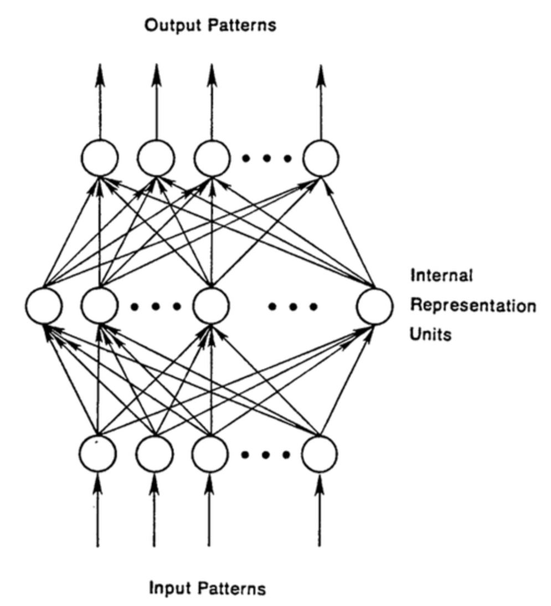
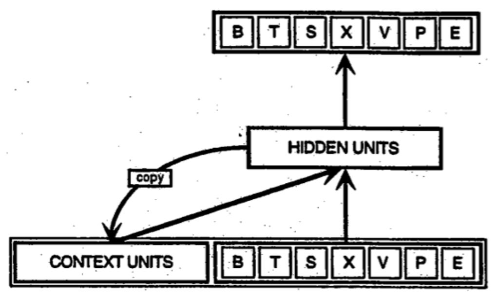
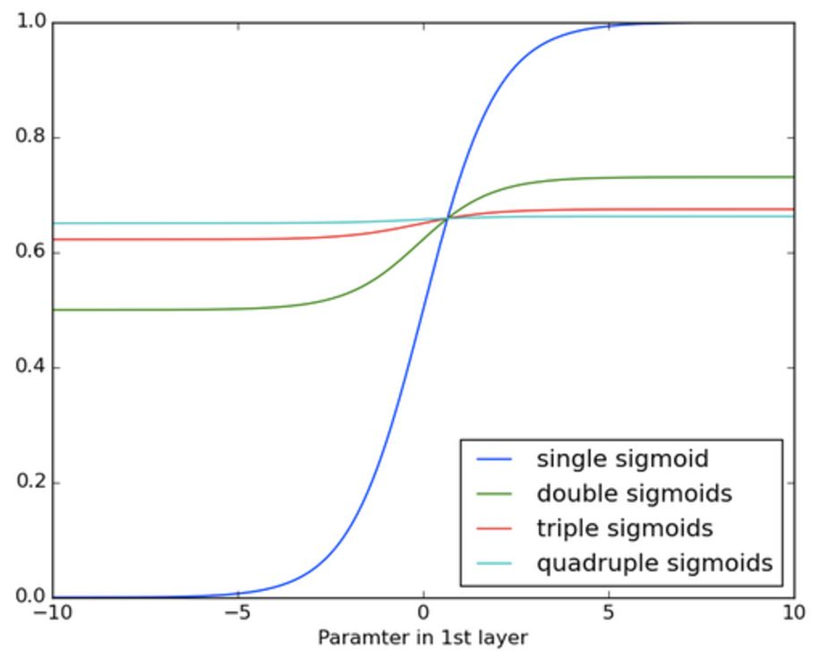
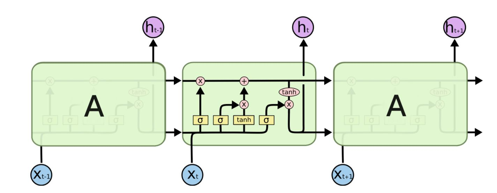
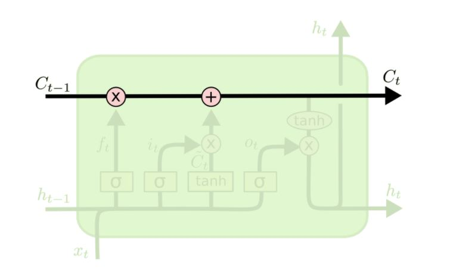
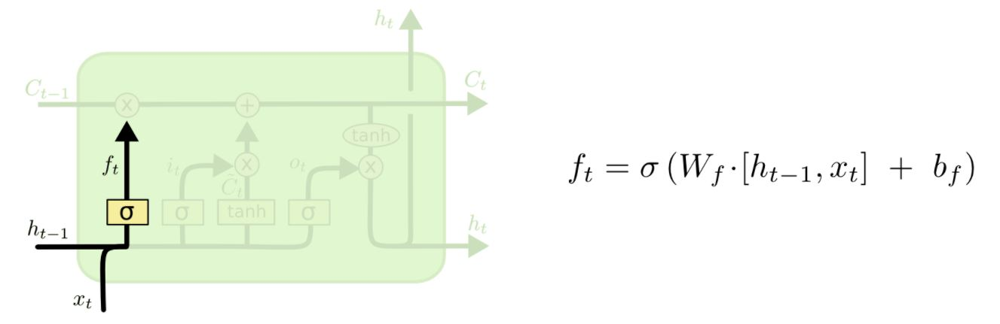
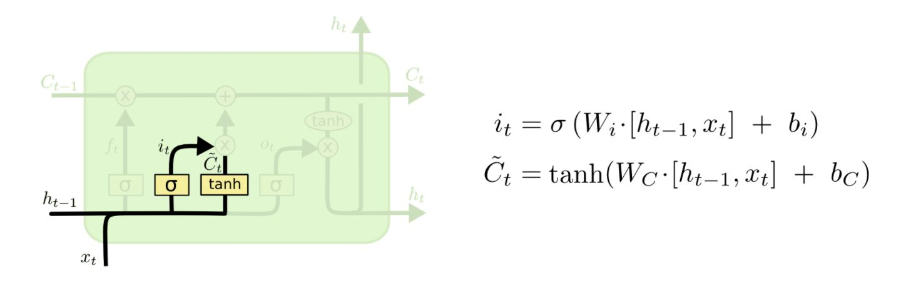
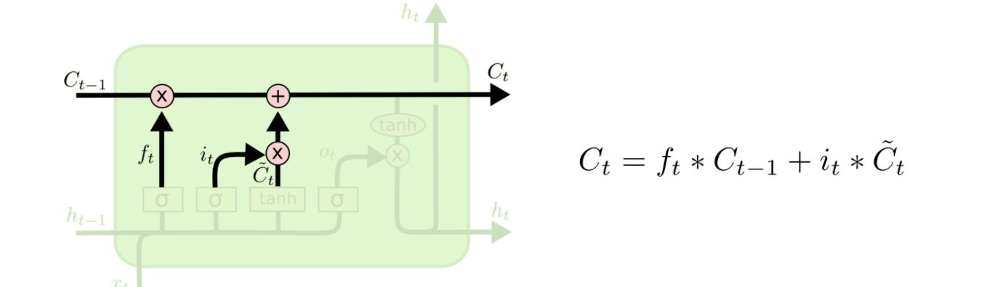
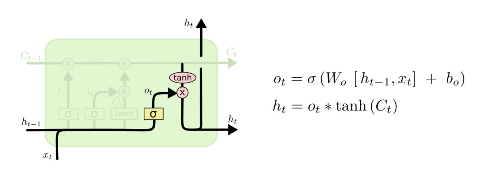
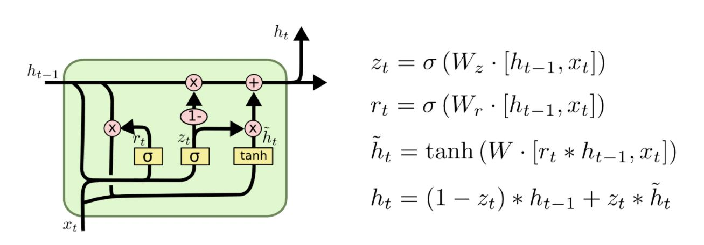

## Recurrent Neural Networks

Classification을 할 수 있다는 것도 재미있지만, 사실 진짜 재미있는 것은 미래를 예측해보는 것이 아닐까요? 어떤 사람들은 날씨를 예측하기 위해, 또 어떤 사람들은 주식투자를 잘 하기 위해 시간마다 달라지는 데이터를 가지고 있을 것입니다. 이러한 sequence, 시계열 데이터를 가지고 인공신경망이 어떻게 패턴을 인식할 수 있을까요?

바로 RNN(Recurrent Neural Networks)에 대해 이야기해보려고 합니다. RNN에는 LSTM(Long Short-Term Memory)가 많이 쓰이고 있어서 여기서 설명해보고자 합니다.

어떤 사람들은 RNN이 다른 모든 문제에 적용될 수 있다고 이야기하기도 합니다. 실제로 원래는 배열 형태의 데이터에 적용하려고 만들었던 RNN을 이미지에 작은 이미지 패치에 대하여 적용하는 방법도 사용되고 있습니다.
RNN은 계속 받아들인 시계열 데이터를 잊어버리는 것이 아니라 어떤 형태로 가지고 있습니다. 

**Feed Forward Network
RNN과 비교하기 위해 우리가 알고 있는 인공신경망(Feed Forward Network)를 생각해봅시다. 앞에서 배웠던 MLP(Multi-Layer Perceptron)이 대표적인 예시가 됩니다. FFNet은 input layer에서 입력을 받은 후 차례대로 배치되어 있는 은닉층(hidden layer)를 거쳐서 output layer가지 진행하게 됩니다.

FFNet의 경우 시간에 대한 감각이 없다고 할 수 있습니다. 계속해서 학습할 수록 성능은 좋아지겠지만, 앞에서 어떤 사진을 봤는지, 뒤에 어떤 사진이 올지 관심이 없습니다. 그때 그때 들어오는 입력에 대해서만 바보같이 결과를 내놓는 FFNet이 되겠습니다.

RNN의 경우에는 입력이 directed cycle을 만들 수 있습니다. 다시 말하자면, 은닉층의 결과가 다시 같은 layer의 은닉층의 입력으로 들어갈 수 있게 되어있습니다.

**simple RNN**

RNN의 경우 FFNet과는 다르게 과거에 입력받은 데이터를 동시에 고려한다고 하였습니다. Elman이 제안한 초기의 RNN의 구조는 다음과 같이 생겼습니다.

**BPTT: Backpropagation Through Time**

RNN은 시계열의 데이터를 학습한다고 배웠습니다. 그렇다면 학습은 어떻게 하게 될까요? 다른 인공 신경망의 학습과 같이 Backpropagation과 Gradient Descent를 사용하게 됩니다.

**Truncated BPTT: 끝까지 거슬러 올라가지는 않는다**

BPTT는 원래 입력된 모든 시간에 대해서 backpropagation을 하게 됩니다. 그러나 아주 긴 시계열 데이터의 경우, 계속 은닉층에 저장하는 양이 늘어나게 되어 결국 성능이 나빠지게 됩니다. 이를 해결하는 방법이 일단 이전에 받은 입력을 일정 범위까지만 기억을 하는 것입니다. 말하자면 단기기억만 이용하는 것인데, 물론 BPTT보다 단기 BPTT가 기억이 짧으므로 한계점이 있지만, 경우에 따라서는 크게 문제가 되지 않는 경우도 있고 (Markov 가정을 잘 따른다면) 또 모든 것을 기억할 수 없다는 현실적인 문제가 있어 사용되곤 합니다.

**Vanishing (or Exploding) Gradients**

RNN에 대한 연구는 1980년대부터 진행되어왔습니다. 다중퍼셉트론(MLP)에서 XOR문제가 나타난 것처럼, RNN에서는 *vanishing gradient* 라는 문제가 나타나게 되었습니다.

Backpropagation을 하기 위해서는 각 층 또는 한 RNN cycle에 대해서 gradient를 계속 계산하고 또 이를 곱하여 다음 gradient를 업데이트하는 과정을 반복적으로 거치게 됩니다. 문제는 이렇게 계산한 gradient 값이 입력 받은 데이터가 길수록, 과거로 많이 올라가야 하는 경우 학습이 잘 안된다는 것입니다.

방금 말씀드렸듯이, RNN에서 학습을 하기 위해 gradient를 계산하는데, 신경망이 이를 다음 층으로 넘기는데 사용하는 연산이 곱셈으로 이루어져 있기 때문에 발생하게 됩니다.

여러분이 잘 알듯이, 곱셈을 반복적으로 하다보면 0으로 수렴하거나, 또는 한없이 값이 커질 수 있습니다.

그래서 두 가지 문제가 발생할 수 있게 됩니다. gradient가 완전 소실(vanishing gradient)되거나 아주 큰 값으로 발산(exploding gradient)하는 경우입니다. 발산의 경우는 해결 방법이 있기는 합니다. gradient 값을 제한해주는 것이죠. 그러나 문제는 0에 한없이 가까워지는 경우입니다. 0에 가까워질수록 학습속도가 매우 느려지거나 또는 거의 학습 자체가 되지 않을 수도 있겠습니다.

위 그림은 시그모이드를 여러번 곱하는 과정에서 값이 어떻게 변하는지 보여주는 표인데, 곱하기를 불과 몇 번 밖에 하지 않았는데 기울기가 거의 0에 가까워지는 것을 볼 수 있습니다. 만약 100개, 200개 또는 그 이상의 데이터 입력에 대해서 BPTT를 사용한다면 끝에 가서는 거의 학습이 되지 않을 것이라고 생각할 수 있습니다.

**LSTM(Long Short-Term Memory Units)**

LSTM은 RNN에서 발생하는 vanishing/exploding gradient 문제를 해결하기 위해 고안되었습니다. 오차의 gradient가 시간을 거슬러서도 0에 가까워지지 않고 끝에서도 학습이 될 수 있도록 장치를 만든 것이지요. 어떤 결과에서는 1000, 2000 단계 넘어서까지 오차가 전달이 될 수 있다고 하니까, 기존의 RNN보다 더 장기적인 기억을 가지고 있다고도 이야기 할 수 있겠습니다.

LSTM의 구조를 알아보도록 하겠습니다. LSTM은 다음과 같이 생겼습니다. 

여러개의 LSTM이 구조를 이루고, 하나의 LSTM 유닛은 여러 개의 gate들이 연결되어있는 cell들로 구성되어있습니다. 이 cell의 정보를 잊어버릴지, cell의 정보를 불러올지, cell의 정보를 그대로 유지할지 내부적으로 결정하게 됩니다. 결정하는 기준은 연결된 gate가 어떤 값을 뱉어내느냐에 따라서 달라지게 됩니다. 여기서 이 gate들은 0에서 1사이의 값을 가지게 됩니다.

그렇다면 하나의 LSTM 유닛에서 각 게이트의 가중치(weight)들은 어떻게 학습도리까요? 역시 hidden layer의 가중치를 학습하는 것과 같이 gradient descent를 이용하게 됩니다.

이 [블로그](http://colah.github.io/posts/2015-08-Understanding-LSTMs/)에 매우 잘 나와있으니 참고해보세요.

**LSTM의 기본 아이디어**

LSTM에서 가장 기본이 되는 것은 위 그림에서 나온 것 처럼 가장 맨 위의 줄, 즉 cell state를 나타내는 것입니다. 마치 컨베이어벨트와 같이 그림에서 쭈욱 이어져 있는 것을 볼 수 있는데, 게이트의 값에 의해서 값을 바꿔주지 않는다면 이대로 주욱 값이 연결될 것입니다.

처음에 `h_t-1`, `x_t`의 값에 의해 게이트의 값이 결정이 되는데, 0에서 1사이의 값을 가지게 됩니다. 0의 값은 cell state를 잊어버리겠다는 것이고, 1의 값은 온전히 cell state의 값을 기억하겠다는 것입니다.

**친절한 LSTM 단계별 설명**

위에서 설명한 대로 cell state의 값을 바꾸고 기억하거나 잊어버리는 과정이 가장 중심이 되는 과정입니다. 이제 순서대로 그 과정을 알아보겠습니다.

위 그림은 "forget gate layer"를 설명하고 있습니다. 입력값을 보고 sigmoid 함수를 통과시켜서 0에서 1 사이의 값을 가지게 합니다. 이렇게 해서 cell state를 잊어버릴지 가져갈지 결정하게 됩니다.

예를 들어, 문장을 lstm으로 분석한다고 할 때, 과연 어떤 특정한 자리에 "cat"이 와야 할지 "cats"가 와야할지 결정 할 때, 과거에 복수형인지 단수형인지 정보를 기억하여 정확한 결과를 낸다는 이야기입니다. 또 다른 명사 "dog"가 나온다면 "cat"에 대한 정보를 잊고 판단을 하는 식으로 작동하게 됩니다. 아주 정확한 비유는 아니지만, 이해를 돕자면 그렇습니다.

다음 과정은 어떤 정보를 cell state에 담을 것인지 결정하는 단계입니다. "input gate layer" 라고 불리는 sigmoid layer가 어떤 값을 업데이트 할 지 결정하게 됩니다. 또한 tanh 층이 어떤 후보 값들을 만들어냅니다. 

위 그림에서 처럼 input gate layer와 tanh에서 만들어진 후보 값들이 나오게 됩니다.

이렇게 만들어진 두개의 값을 서로 곱해주게 되는데, 새롭게 업데이트할 값을 결정하는 것입니다. 이제 아까 잊어버릴지 말지 결정한 cell state 값으로 다음과 같이 더해주게 됩니다.

이제 어떤 값을 출력으로 할지 결정하는 단계입니다. 일단 cell state에 tanh를 씌워서 -1에서 1 사이의 값을 만들게 됩니다. 또한 입력된 값에서 나온 activation 값을 (`o_t`) tanh layer에서 나온 값과 곱해서 출력으로 해 주게 됩니다.

또한 이전의 출력값 `h_t`는 다음 LSTM 유닛의 입력으로 들어가게 됩니다.

이렇게 해서 단계별로 LSTM에서 일어나는 일들을 살펴보았습니다.

**GRU**
2014년 뉴욕대학(NYU)의 조경현 교수님이 발표한 GRU(Gated Recurrent Unit)는 forget/input gate를 하나의 "input gate"로, 그리고 cell state와 hidden state를 하나로 합친 모델입니다. 기존의 LSTM 모델보다 훨씬 간단하며 최근 많이 쓰이고 있습니다.

이 외에도 Depth Gated RNN, (Yao, et al. 2015), Clockwork RNN, (Koutnik, et al. 2014)과 같은 여러 LSTM의 변종들이 나오기도 했는데요, 어떤 것이 가장 좋은 모델일까요?

Greff, et al. (2015)에서 여러 유명한 모델에 대해서 비교해 본 결과 거의 비슷한 성능을 내는 것으로 나타났습니다. Jozefowicz et al. (2015)는 천 개 이상의 RNN 아키텍쳐에 대해여 비교를 하였는데, 어떤 모델들은 특정한 문제에 대해서 LSTM 보다 더 성능이 좋다는 것을 밝혔습니다.

