## Introduction to Machine Learning

2016년 3월 구글 딥마인드의 알파고가 이세돌 9단에게 승리한 것은 인공지능 기술의 가능성을 국내 대중들에게 각인시켜주는 큰 사건이었습니다. 이처럼 최근 인공지능 기술은 많은 발전과 더불어, 여러 응용 분야에서도 두각을 나타내고 있습니다. 구글의 구글 신경망 기계 번역기 (GNMT; Google Neural Machine Translation)는 그 대표적인 사례입니다. 또한 구글, 페이스북, 바이두, 오픈에이아이 등의 IT 기업들이 자체적으로 연구소를 설립하여 연구들을 진행하고 있습니다. 이외에도 아마존, 넷플릭스 등의 기업들은 인공지능 기술에 대한 상업적 가치를 인지하고, 서비스 혹은 제품을 차별화시키기 위하여 상업적으로 인공지능을 접목시키려고 시도하고 있습니다. 상업적인 활용 말고도 의학, 공학, 자연과학 모든 분야에서 인공지능 기술들이 변화를 가져다주고 있습니다.

이러한 인공지능이 가져다주는 큰 변화와 흐름을 인지하고 활용하기 위해서는, 기초 공부가 필수적입니다. Deepest 강좌의 첫 번째 목적은 여러분들이 실제로 이러한 기술들을 더 연구하고, 다른 분야에 적용시키고 유용하게 쓸 수 있도록 그 기초를 다지기 위함에 있습니다. 앞으로 Deepest 강좌는 이론/실습으로 구성되어 여러가지 인공지능 기술들의 이론들에 대해 공부하고, 또 직접 다뤄보면서 어떻게 구현하는지 체득하도록 도와줄 것입니다. 역시 돌려봐야 아는 것이죠!

이 단원은 기계학습에 대한 가장 기초적인 내용들에 대해 다루었습니다. 이 글을 읽는 많은 분들이 이미 알고 계신 내용들일 것으로 예상됩니다. 이미 알고 있는 분들은 가볍게 읽거나 넘어가셔도 좋을 것 같습니다. 그리고 파이썬, 선형대수학, 미분, 편미분 등 더 기본적인 내용들이 있지만 독자들이 수학, 프로그래밍을 어느 정도 알 것으로 가정하고 작성되었습니다. 

**Artificial Intelligence(AI)**

앞서 말씀드렸다싶이, 인공지능은 최근 많은 응용 분야에서 두각을 나타내고 있습니다. 모든 연구분야와 서비스 산업에서 적용되고 있습니다. 사실 인공지능이 학문 분야로 들어선 것은 지금보다 60여년 전인 1956년입니다. 인공지능이 비교적 ‘최근에’ 급부상하게 된 이유는 크게 두 가지로 정리할 수 있습니다. 컴퓨터의 계산 능력 증가와 딥러닝의 등장입니다.
다시 돌아가서 인공지능이 뭐냐고 묻는다면, 환경을 인지하고 주어진 목적이 성공할 기회를 최대화시키도록 행동하는 ‘기계’가 가진 ‘지능’이라고 정리할 수 있습니다.

* 규칙 기반 인공지능
* 데이터 기반 인공지능

인공지능은 두 가지 방식으로 나누어 볼 수 있습니다. 규칙 기반 인공지능은 인간이 미리 설정해 놓은 규칙대로 동작하는 인공지능을 말합니다. 규칙 기반 형태의 인공지능은 규칙을 준수하도록 일일이 명시적으로 프로그래밍해야하는 한계점이 있습니다. 따라서 규칙이 복잡해지는만큼 구현도 복잡해지고 규칙에 따라서 나타나는 형태가 전부 달라지게 됩니다. 반면 데이터 기반 인공지능은 주어진 데이터를 통해서 스스로 동작하는 인공지능을 말합니다. ‘기계학습’이라는 주어진 데이터를 가지고 인간처럼 스스로 학습하여 답을 내리는 방식은 데이터 기반 인공지능을 가능하게 했습니다. 복잡한 규칙들을 따라 프로그래밍 할 필요가 없습니다.

---

## What is Machine Learning?

기계학습은 다음과 같이 정의됩니다.
>Tom M. Mitchell, "A computer program is said to learn from experience E with respect to some class of tasks T and performance measure P if its performance at tasks in T, as measured by P, improves with experience E.“

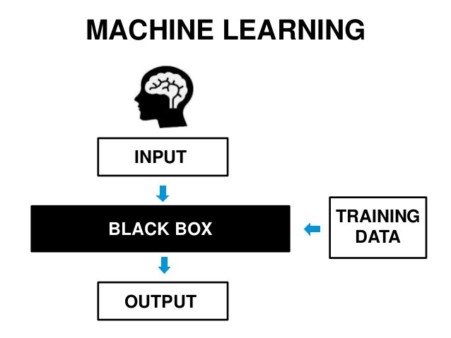
출처: https://en.wikipedia.org/wiki/K-nearest_neighbors_algorithm

어떤 태스크를 투입이 있을 때 적절한 산출을 하는 것으로 정의하면, 그 태스크를 수행하는 블랙박스로서 이해하면 편합니다. 블랙박스는 학습 데이터를 통해 어떤 투입에 대해서 어떤 산출을 해야하는지 학습하게 됩니다. 그렇다면 어떻게 기계학습을 구현할 수 있을까요? 우선 기계학습이 학습 방식에 따라 크게 세 가지로 분류된다는 것을 알아야 합니다.

* Supervised Learning
* Reinforcement Learning
* Unsupervised Learning

**Supervised Learning**

첫 번째는 지도학습입니다. 본 강좌에서 주로 다루게 될 내용입니다. 투입에 대한 산출의 답이 미리 주어진 경우입니다.
 
 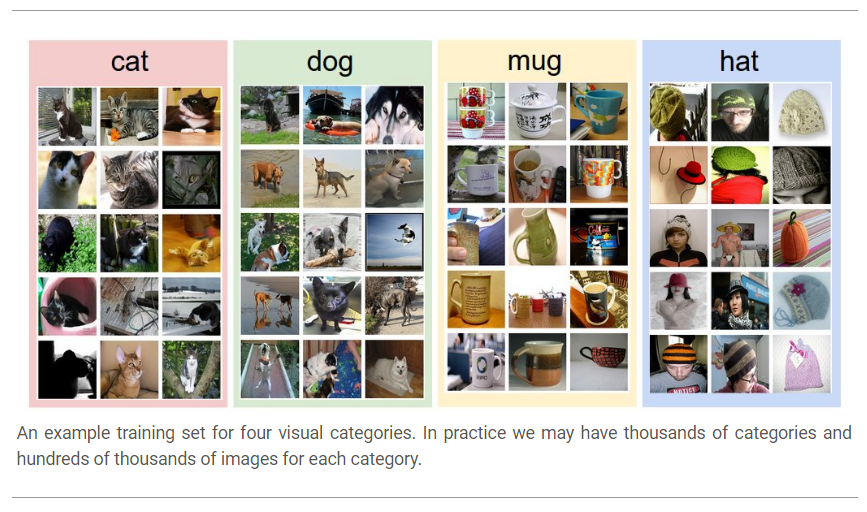
출처: http://cs231n.github.io/classification/

대표적인 태스크로 분류 (classification)과 회귀 (Regression)이 있습니다. 분류는 위와 같이 이미지 안에 있는 물체를 무엇으로 분류할지에 대한 태스크입니다. 물체가 나와있는 사진과 그 물체가 무엇인지에 대한 정보를 같이 주어서 학습시키는 방식입니다. 회귀는 연속적인 값을 추정하는 태스크입니다. 뒤에서 좀 더 자세하게 살펴보겠습니다.

**Image Classification**

컴퓨터 비젼 (Computer Vision) 분야의 대표적인 태스크 중 하나인 사진 분류를 통해 지도학습이 어떻게 이루어지는지 살펴보겠습니다. 사진 분류 태스크는 다음과 같은 과정들을 포함하고 있습니다.
•  투입 및 산출 (Input and output): 투입은 N개의 이미지로 구성되며 K개의 물체 분류 중 하나로 산출의 답이 정해져있습니다. 이 데이터들을 훈련 집합 (training set)이라고 부릅니다.
•  학습 (Learning): 훈련 집합을 통해, 태스크에서 물체 분류를 잘 수행할 수 있도록 학습이 이루어집니다. 이것을 분류기 (classifier)를 훈련한다 혹은 모델 (model)을 학습한다고 지칭합니다.
•  평가 (Evaluation): 마지막으로 학습이 잘 이루어졌는지 시험 집합 (test set)을 통해 검증 단계를 거칩니다. 모델의 정확도 (accuracy)가 얼마나 되는지 확인할 수 있습니다.

**Reinforcement Learning**

두 번째는 강화학습입니다. 정해진 답이 주어져있지는 않지만, 행동을 취한 뒤에 그 행동을 평가할 수 있는 경우입니다. 주로 체스, 바둑과 같은 게임 태스크를 위한 학습 방법입니다.

**Unsupervised Learning**

마지막은 비지도학습입니다. 산출에 대한 아무런 정보가 없을 경우입니다. 오직 투입 데이터들만 가지고 학습하게 됩니다.

**K-최근접 이웃 알고리즘 (K-Nearest Neighbor Algorithm)**

K-최근접 이웃은 사진 분류 태스크를 수행할 수 있는 기계학습 알고리즘 중 하나입니다. 각각의 사진들은 픽셀 데이터로 이루어집니다. 두 사진의 픽셀 데이터 차를 이용해서 사진 간의 거리를 구할 수 있습니다. 분류해야할 검증 표본에 대해 그 주변에서 거리가 가장 가까운 K개의 훈련 표본들 중에서 가장 빈번한 분류명을 할당하는 방식입니다.

참고: https://en.wikipedia.org/wiki/K-nearest_neighbors_algorithm
K-최근접 이웃 알고리즘의 가장 큰 단점은 시험 시간이 매우 길다는 것입니다. 기계학습의 특성 중 하나는 학습 시간을 늘리고 대신에 시험 시간을 줄이는 것입니다. K-최근접 이웃 알고리즘은 이런 특성에 어긋나기 때문에 실제로 사진 분류 시에는 나중에 소개할 다른 기계학습 분류기들을 사용합니다.

---

## Linear and Logistic Regression

선형 회귀와 로지스틱 회귀는 가장 기본적인 기계학습 기법입니다.

**선형 회귀 (Linear Regression)**

선형 회귀는 선형의 데이터가 들어왔을 때, 어떤 투입 값이 들어오면 그 투입 값에 해당하는 산출 값을 예상하는 태스크입니다. 먼저, 모델이라고 볼 수 있는 가설 (Hypothesis)를 세웁니다. 선형 회귀의 경우는 가설이 선형식으로 이루어집니다. 일변수 일차원 선형 회귀를 생각해보겠습니다. 투입 값을 x, 산출 값을 y라고 하면 가설 H(x)는 다음과 같습니다.

$$
H(x) = Wx + b
$$

통계학적으로 적절한 W, b를 추정하는 방식이 있지만 기계학습에서는 ‘학습’을 통해 가설의 적절한 매개변수 값들을 찾아나가게 됩니다. 그러기 위해서는 가설로 예상한 값과 실제 값의 차이를 계산하는 비용함수 (Cost Function)이 필요합니다. 비용함수는 손실 (Loss)라고 부르기도 합니다. 선형 회귀에서는 다음과 같이 비용함수를 정의합니다.

$$
Loss=\mathbb{E}\left[(H(x_i )-y_i)^2\right]
$$

학습의 방향은 다음과 같이 비용함수가 최소화되는 매개변수 W와 b를 찾는 것입니다.

$$
min_{W,b}\left( Loss(W,b) \right)
$$

어떻게 비용함수가 최소화되는 매개변수를 찾을 수 있을까요?

---

## Gradient Descent Algorithm

답은 비용함수의 기울기 (gradient)를 구한 다음에 기울기와 반대되는 값으로 매개변수들을 조금씩 움직여가는 방법입니다. 이것을 경사 하강법이라고 합니다. 경사 하강법을 지속적으로 적용하면서 함수 값은 극소점 (local minimum)을 찾아가게 됩니다.

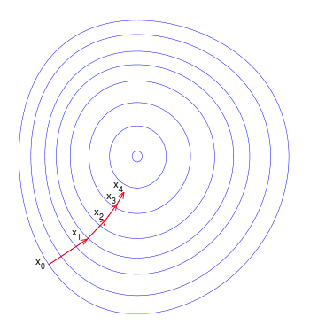
 
참고: https://en.wikipedia.org/wiki/Gradient_descent
경사 하강법의 특징 중 하나는 함수의 최소값이 아닌 극소값을 찾아가는 것입니다. 볼록 함수 (convex function) 경우에 이러한 문제를 방지할 수 있습니다.
 
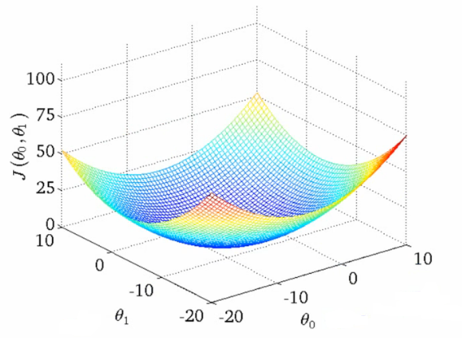
볼록 함수
 
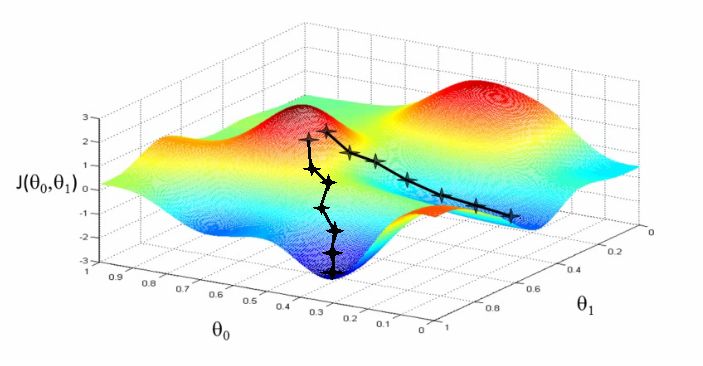
볼록 함수가 아닌 함수
출처: https://www.coursera.org/learn/machine-learning

**Multivariate Linear Regression**

투입 변수가 여러 개이더라도 방식은 똑같습니다. 다만 변수를 하나로 묶어서 다음과 같이 행렬의 연산으로 나타낼 수 있습니다.
$$
H(x_1,x_2,⋯,x_n )=w_1 x_1+w_2 x_2+⋯+w_n x_n+b\\
H(X)=W^T X + b
$$

선형 가설 설정 -> 비용 함수 설정 -> 경사 하강법을 통한 극소점 찾기

**로지스틱 회귀 (Logistic Regression)**

이진 분류 (Binary Classification) 문제는 선형 회귀로는 풀리지 않습니다. 이진 분류 문제는 주어진 투입 값에 대해 산출 값이 0 아니면 1로 나오기 때문에 선형 회귀를 적용하는 것은 적절하지 않습니다. 선형 함수를 사용하게 되면 0에서 1 사이를 넘어가는 값을 갖게됩니다.
따라서 다음와 같은 시그모이드 함수를 사용합니다.
 
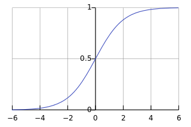
출처: https://en.wikipedia.org/wiki/Sigmoid_function

시그모이드 함수 식은 다음과 같습니다.
$$
S(t)=  \frac{1}{1+e^{-t}}
$$
이러한 시그모이드 함수를 가설로 사용하는 문제를 로지스틱 회귀라고 합니다.
가설에 대한 식은 다음과 같습니다.

$$
H(x)=  \frac{1}{1+e^{-Wx-b}}
$$

비용함수 또한 달라집니다. 아까 선형 회귀의 비용함수와 똑같이 비용함수를 잡으면 함수가 볼록하지 않습니다.
 
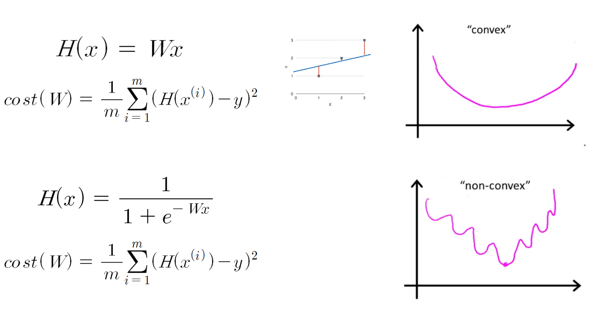
출처: https://hunkim.github.io/ml/
그래서 로지스틱 회귀의 경우에 비용함수는 아래와 같이 표현합니다.
 
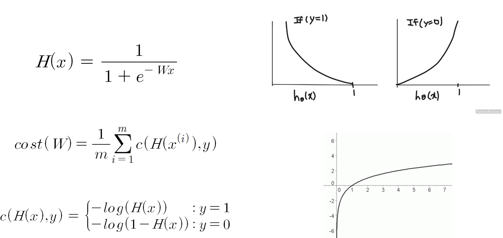
출처: https://hunkim.github.io/ml/
그 뒤로는 똑같이 경사 하강법을 적용하여 극소값을 찾아가게 됩니다.

**Softmax Regression**

다중 (multiclass) 혹은 다항 분류 (multinomial classification) 경우에는 로지스틱 회귀와는 조금 다른 함수를 사용하게 됩니다.
기본적인 아이디어는 N개의 분류가 있을 때, N개의 이진 분류기를 사용하는 것입니다. 다음과 같이 하나의 행렬로 나타낼 수 있을 것입니다.
 
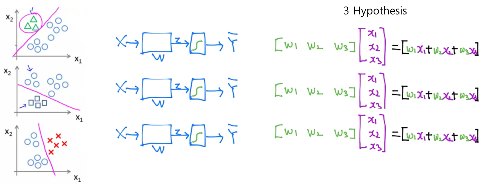
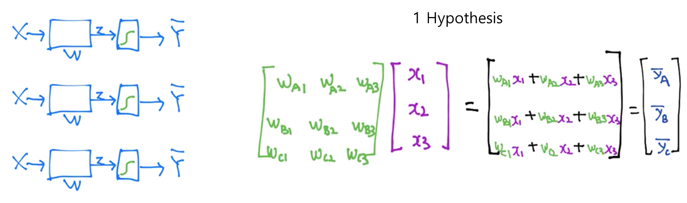
출처: https://hunkim.github.io/ml/
계산된 y 값들은 모두 실수 범위의 값을 갖습니다. 여기서 소프트맥스 (softmax)라는 특별한 함수를 사용하여 y 값들을 모두 확률로 변환시켜줄 수 있습니다. 이런 방식의 회귀를 소프트맥스 함수의 이름을 따서 소프트맥스 회귀라고 부릅니다.
 
 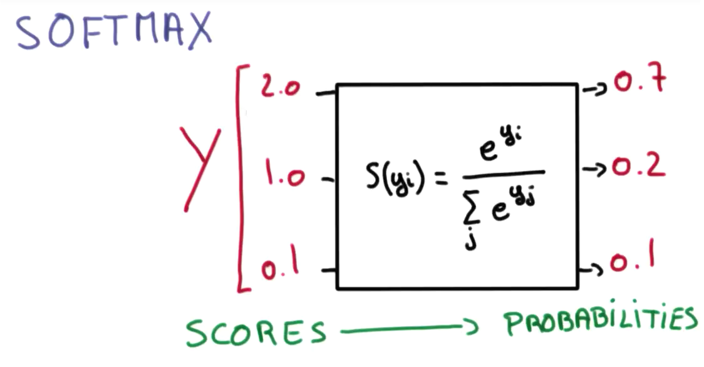
출처: https://hunkim.github.io/ml/
소프트맥스 함수는 다음과 같습니다.
$$
\sigma(z_j) = \frac{exp(z_j)}{\sum_{k=1}^N exp(z_k)}
$$

비용함수 또한 로지스틱 회귀와는 다른 형태를 가지고 있습니다. 비용함수는 다음과 같습니다.

$$
Loss = -\sum_i \hat{y_i} log(y_i)
$$

크로스-엔트로피 (cross-entropy) 함수라고 합니다. 여기서 \\( \hat{y_i} \\)는 실제 산출 값, \\( y_i \\)는 예측 값을 의미합니다. 실제 산출 값은 원핫 인코딩 (one-hot encoding) 방식을 통해 분류에 해당하는 값만 1로 나타내어 집니다. 밑의 그림은 비용함수를 좀 더 시각적으로 나타낸 것입니다.

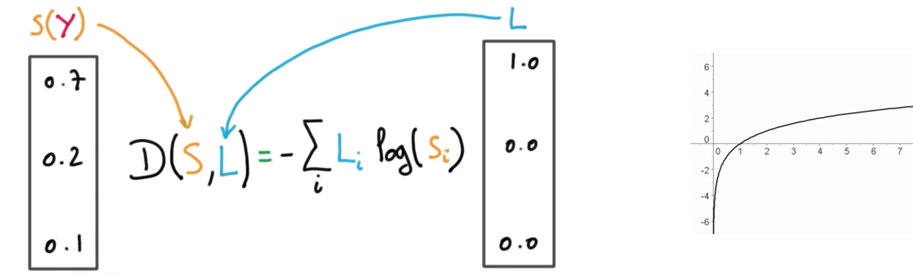 
출처: https://hunkim.github.io/ml/

---

## Practical Machine Learning

기계학습과 관련하여 몇 가지 실용적인 이슈들에 대해서 다뤄보려고 합니다.

**학습률 (Learning Rate)**

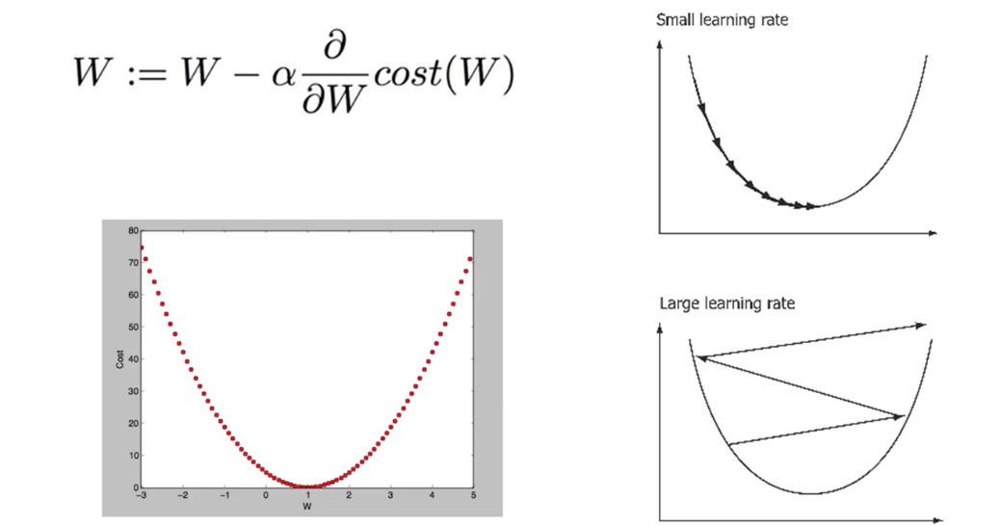 
출처: https://hunkim.github.io/ml/

경사 하강법에서 경사를 따라 움직이는 정도를 학습률이라고 합니다. 학습률을 작게 잡으면 학습이 너무 오래걸리는 문제가 발생하고, 크게 잡으면 극소점을 지나쳐갈 수 있습니다 (overshooting). 학습률을 적절하게 설정해야 합니다.

**Normalization**

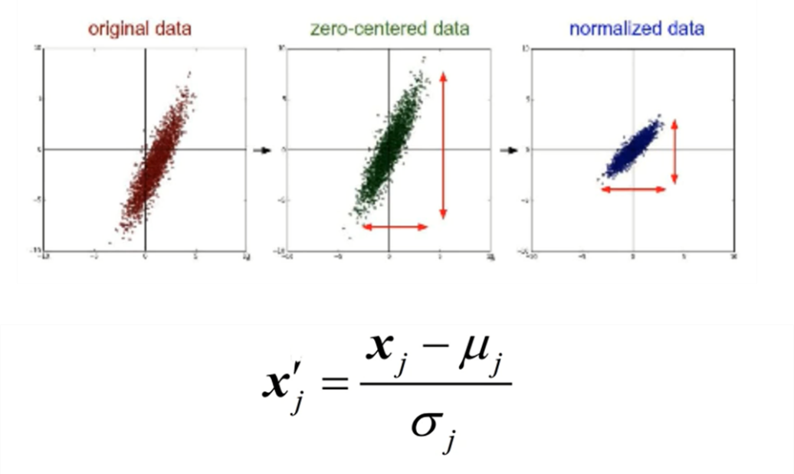

표준화는 데이터를 전처리 할 때 굉장히 많이 쓰이는 기법입니다. 나중에 배치 정규화 (Batch Normalization)에서 더 자세히 다룰 것입니다.

**Bias-Variance Tradeoff and Overfitting**

출처: https://hunkim.github.io/ml/

편향-분산 트레이드 오프는 지도학습 알고리즘이 훈련 집합의 범위를 넘어 지나치게 일반화 하는 것을 예방하기 위해 두 종류의 오차 (편향, 분산)을 최소화 할 때 나타나는 문제입니다.
편향/분산에 대한 더 자세한 설명: https://en.wikipedia.org/wiki/Bias%E2%80%93variance_tradeoff
편향이 큰 모델을 세우면 왼쪽 그림처럼 과소적합 (underfit) 문제가 발생할 수 있으며, 너무 큰 모델을 세무면 오른쪽 그림처럼 과적합 (overfit) 문제가 발생할 수 있습니다.
특히 나중에 배울 딥러닝에서는 매우 많은 매개변수들을 사용하기 때문에 과적합 문제가 빈번하게 발생합니다.

**Regularization**

앞서 언급된 과적화 문제를 해결하기 위해서 많은 방법들이 제시되었는데, 그 중 하나로 정규화가 있습니다. 비용함수에 매개 변수의 크기 값을 포함시켜서 매개변수의 범위를 제한하는 방법입니다. 분산을 줄여서 과적합 문제를 해결할 수 있는 대신에, 비용함수가 조금 더 복잡해진다는 단점이 있습니다.
 
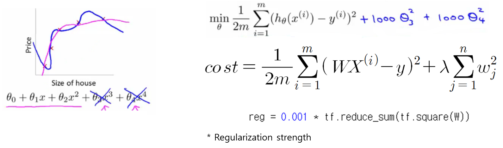
출처: https://hunkim.github.io/ml/

**하이퍼파라미터 (Hyperparameter)**

모델을 구성하지만 모델이 학습하면서 직접 최적화해나가는 매개변수가 아닌 미리 설정되는 매개변수들을 구분하여 지칭하기 위해 쓰이는 단어입니다. 예를 들어서, K-NN 알고리즘에서는 K 값과 거리함수 d를 어떻게 정의할지가 하이퍼파라미터입니다. 학습률이나 정규화 매개변수 또한 하이퍼파라미터입니다. 훈련된 모델이 최적의 성능을 내기 위해서는 최적의 하이퍼파라미터 값을 찾는 것이 중요합니다.
 
**훈련/시험/확인 집합 (Training/Test/Validation Sets)**

앞서 설명된 최적의 하이퍼파라미터 값을 찾기 위해서는 훈련 및 시험 집합 외에도 확인 집합이 필요합니다. 시험 집합의 데이터를 이용해서 학습을 시킬 수는 없기 때문에 훈련 집합에서 일부 데이터를 나누어, 확인 집합을 만듭니다. 확인 집합을 통해 하이퍼파라미터 값을 조절할 수 있습니다.

**확률적 경사 하강법 (Stochastic Gradient Descent)**

큰 데이터 집합에 대해서 전체 데이터를 한 번에 사용해서 훈련시키는 것은 불가능합니다. 보통 미니 배치 (mini-batch)라는 작은 데이터 집합 단위들로 쪼개서 경사 하강법 알고리즘을 적용합니다. 이때 미니 배치에 들어갈 데이터들은 랜덤하게 결정됩니다. 이러한 알고리즘을 확률적 경사 하강법이라고 합니다.

**MNIST 데이터 집합**
기계학습에서 자주 쓰이는 데이터 집합이 몇 개가 있습니다. MNIST는 딥러닝 대가 중 한 명인 Yann LeCun 교수가 만든 데이터 셋입니다. 손으로 쓰여진 0부터 9까지의 숫자 사진들로 이루어져 있습니다. 모든 사진들은 자신의 숫자로 레이블링 되어있습니다. 55,000 장의 훈련 집합, 10,000장의 시험 집합, 그리고 5,000 장의 확인 집합으로 이루어져 있습니다.

---
